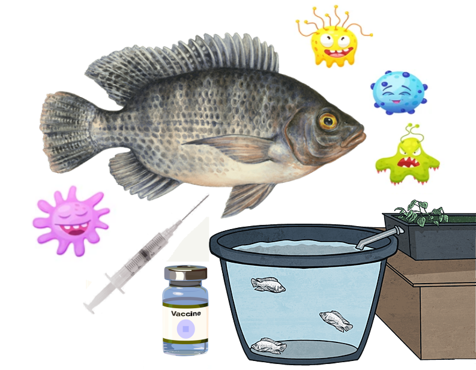
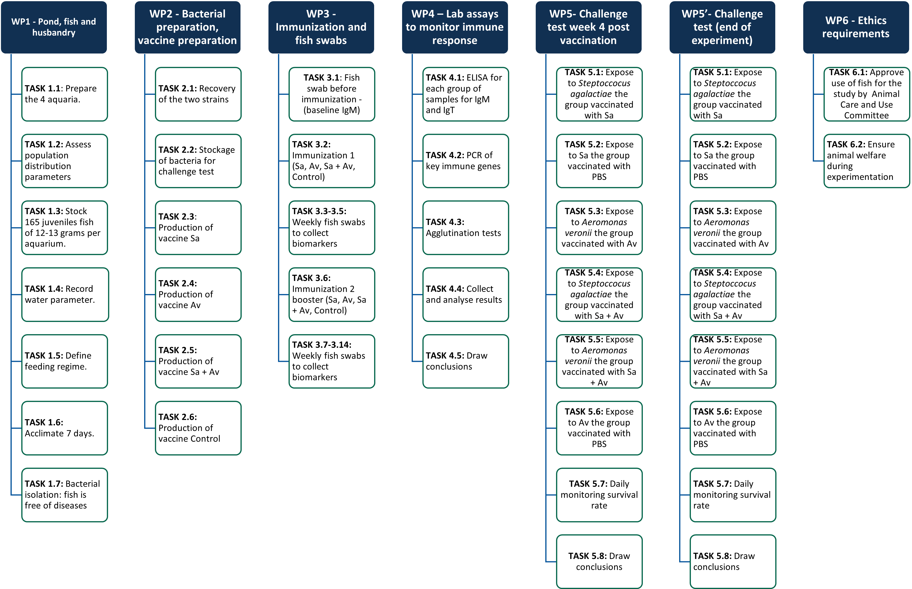
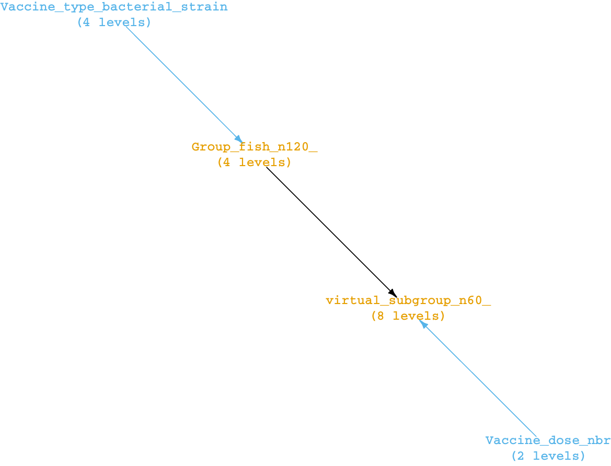
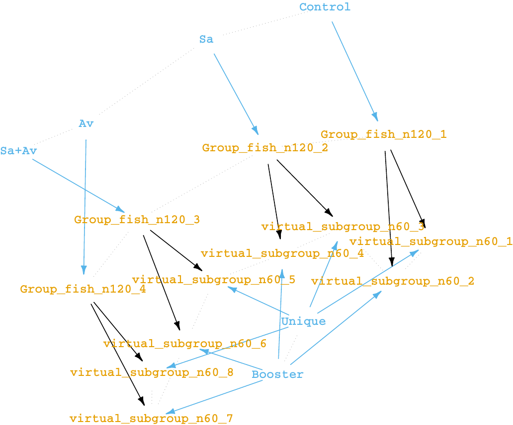
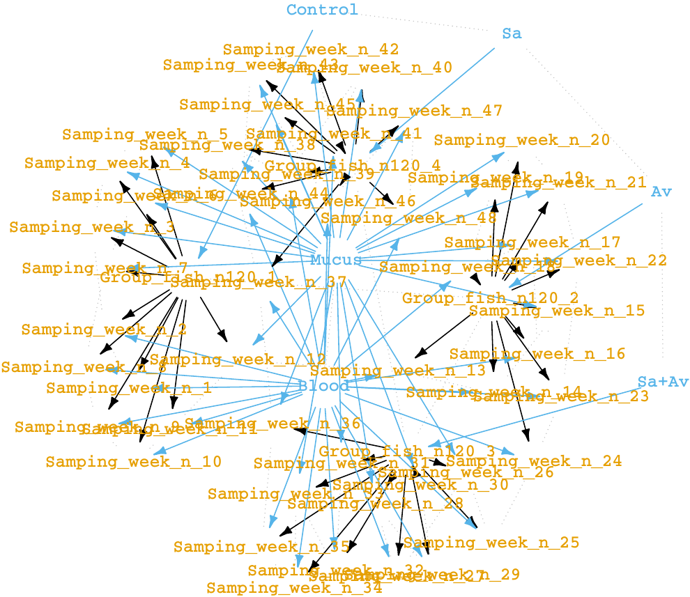

--- 
title: "Systemic and mucosal immune responses of fish Nile tilapia to monovalent and bivalent inactivated vaccines from Streptococcus agalactiae and Aeromonas veronii"   
author: "By Quentin Andres ~ MSc. Aquaculture and Aquatic Resources Management, Asian Institute of Technology, Pathum Thani, Thailand"
date: "`r Sys.Date()`"
site: bookdown::bookdown_site
documentclass: book
bibliography: [book.bib, packages.bib]
# url: your book url like https://bookdown.org/yihui/bookdown
# cover-image: path to the social sharing image like images/cover.jpg
description: |
  This online book will be updated regularly during the master research at the Asian Institute of Technology. It aims to cover my progression in the study of Tilapia's immune response  to the whole bacteria killed vaccines.
link-citations: yes
always_allow_html: yes
github-repo:  Isoris/Inactivated-vaccines-tilapia 
header-includes:
  - \usepackage{subfig}
  - \usepackage{float}
  - \usepackage{titling}
  - \pretitle{\begin{center}
    \includegraphics[width=2in,height=2in]{logo.png}\LARGE\\}
  - \posttitle{\end{center}}
---
```{r, eval=FALSE}
#install.packages("webshot")
webshot::install_phantomjs()
```
# Front matter {-}

<style>
body {
text-align: justify}
</style>

**Fighting infections** from the bacteria *Streptococcus agalactiae* and *Aeromonas veronii* **in Nile tilapia** (*Oreochromis niloticus*) is a **hot-topic** research for aquaculture. Both bacteria are cosmopolite and are causing high **mortality** in infected ponds. Moreover, a diseased fish, if consumed raw can easily become a vector for the transmission to animals and/or humans. **Prophylactic measures** such as fish **vaccination** are a specific and very **effective way of prevention** from diseases. In the present study, we aim to demonstrate that immunization is possible in Tilapia. By using **inactivated vaccines** prepared from formalin-killed pathogens, we were able to produce **two monovalent vaccines** from *Streptococcus agalactiae* and from *Aeromonas veronii*, **and a bivalent vaccine** from the combination of the two pathogens with a ratio of 1:1. **six-hundred and sixty juveniles** were acclimated  and split into **4 groups** in separate aquaria for the **first vaccination**: **1 control (Ct)** and **3 treatments** (**Sa**, **Av**, **Sa+Av**) at (day 0). A second **booster** will be administrated **3 weeks later** (day 21) for **only half of the fish**. From the first day of vaccination, 8 individuals per group** were selected for **sampling weekly**. Immune response, both systemic and mucosal was characterized for humoral immunity using concentrations in **Immunoglobulins M** obtained by **ELISA** and **agglutination antibody titer** test. In addition, 3 individuals were sacrified each week to provide tissues of **head kidneys** and **liver** for **IgM gene** expression analysis via **RT-PCR** before, during and after immunization. Prior to the **second vaccination**, on **week 3 (21 days)**, **half of the fish** of each group was moved into **12 laboratory aquaria** for a future **first bacterial challenge** at 4 weeks (day 28). The other half of the fish, which received the **second vaccination** was moved in **12 laboratory aquaria** at **12 weeks post vaccination** and **challenged** a week later. Briefly, the challenge is an intra peritoneal injection of a single lethal dose of *Streptococcus agalactiae* or *Aeromonas veronii*, respective of the vaccination of the fish. Variability of the survival rates in each challenge group is a direct consequence of vaccination. 


```{r, echo=FALSE, out.width='\\textwidth'}

```
*Access the project timeline: https://thesistimelinequentin.netlify.app/ *

# Introduction

<style>
body {
text-align: justify}
</style>

## Background {-}

In order to sustain an intensified and resilient Cichlids' aquaculture model, many research units and private companies around the world are studying immune responses of fish against viral and bacterial infections and are developing vaccines. There is currently no existing formulation of vaccine that can protect the fish against S.agalactiae and A.veronii, two major fish pathogens, at once. Prophylaxis treatments for cultured fish must be accessible and convenient to use, as well as efficient and durable. Oil-based formalin-killed vaccines score all the criteria. They are convenient for small and medium scale aquaculture production systems.


### Freshwater cultured fish are prone to microbial pathogens {-}

Two pathogens, S.agalactiae and A.veronii are the etiological agent of bacterial infections in freshwater cultured fish. They can be found all over the globe, with reported outbreaks in Japan, Taiwan, and the United States. They induce mass mortality of the infected fish within a few days. The two bacterial isolates used in this research are from Thailand.. Those isolates are highly pathogenic and their presence may create substantial economic loss for the farmers.In Thailand, freshwater fish culture is of first importance for the economy and for the food safety. Nile tilapia (Oreochromis niloticus) is the most produced fish and represent almost 50% of the total freshwater fish production for Thailand. However it is also the most touched by infections from S.agalactiae and A.veronii. The proportions of fish species cultured are in the figure below:

```{r echo=FALSE, fig.cap="Proportion of freshwater fish species farmed in Thailand. Adapted from: Dr Nopadon Pirarat", message=FALSE, warning=FALSE}
#install.packages("lessR")
# library(ggplot2)
# library(tidyverse)
# library(scales)
# library(ggrepel)
# library(lessR)
# data <- read.csv(file = "freshwater_aquaculture_thailand.csv", header = T)
# data <- data %>% arrange(Percentage) %>% mutate(Percentage = Percentage/100) %>% 
#   mutate(pourcent = percent(Percentage))
# attach(data)
# palette <- c( "#F8A51C","#CFCDCD","#FFF2CC","#E2EFD8", "#DDEBF6", "#8EAADB","#7282AA","#5EBAC0")
# pc(data = data, x = Freshwater.fish, y = Percentage, color= "black", lwd = 1.5, values_color= "black", values_size = 1.2,
#    fill = palette, legend_size = 4, text_size = 1.5,label_max=10)

```


My master research at the Asian Institute of Technology aims to study Nile tilapia's immune response to the whole bacteria killed vaccines and prove that 1) vaccines are efficient 2) can immunize against the two bacteria in a single dose.

# Research context

<style>
body {
text-align: justify}
</style>

The following questions will be answered in their corresponding sections.<br/>
<br/>
*Research questions:*   

  - Is the vaccine effective? <br/>
  - How much protection does the vaccines offer to the fish? <br/>
  - Are single formulations (monovalent) as effective as a combination (bivalent)?<br/>
  - Is a booster dose any necessary/useful?<br/>

*Details about the experiment:*

 - What species/strain of fish?<br/>
 - How old are the individuals?<br/>
 - What are the characteristics of the pathogens used in the vaccine?<br/>
 - Where does the experiment takes place?<br/>
 - What are the factors and variables to consider?<br/>
 - What tests will be performed and why?<br/>
 - Who is in charge of carrying the experiments?<br/>
 - What is the timeline? <br/>
 - What can be the majors risks and challenges?<br/>
 - Is the experiment reproducible?, what are the limitations? <br/>
 
# Project organisation

<style>
body {
text-align: justify}
</style>

## Conceptual framework

<br/>

```{r echo=FALSE, out.width='\\textwidth', fig.cap="Conceptual framework"}
knitr::include_graphics("conceptual framework.png")
```

In the initiation phase, the review of the existing literature on vaccination using inactivated vaccines, antibody response and immunology of cichlids was performed. In the planning phase, the list of raw materials was assessed and the methology used was defined: ponds preparation, the fish feeding regime, protocols for bacterial culture, protocol for candidate vaccine development, protocols for fish mucus swabs and blood sampling, protocols for antibody agglutination titration, ELISA, RT-PCR and the protocol for challenge tests. During the execution phase, the fish immune responses after vaccination by each of three candidate vaccines was monitored and associated relevant data were collected. The challenge test in vivo has been performed twice after vaccination (once after first dose, once after booster dose). The results of all the experiments are presented in the final master thesis paper. Finally, during the project closing phase, I have drawn conclusions from the compared vaccines efficiencies. And I have given recommendations on best vaccination protocol to provide the best protection against the two bacterial strains S.agalactiae and A.veronii.

## Split of the work in workpackages

The work packages have been defined in order to split the research work in a list of
tasks.

```{r, fig.cap="Work packages and tasks", echo=FALSE, out.width='\\textwidth'}

```

## Workflow 

```{r echo=FALSE, out.width='\\textwidth', fig.cap="Work packages tasks flow chart"}
knitr::include_graphics("WorkflowHD1.png")
```

## Experimental designs

<br/>

```{r include=FALSE}
library(edibble)
spdes <- start_design("Experimental design for treatments (with control groups)") %>% 
  set_units(Group_fish_n120_ = 4,
            virtual_subgroup_n60_ = nested_in(Group_fish_n120_, 2)) %>% 
  set_trts(Vaccine_type_bacterial_strain = c("Control","Sa","Av","Sa+Av"),
           Vaccine_dose_nbr   = c("Unique", "Booster")) %>% 
  allocate_trts(Vaccine_type_bacterial_strain ~ Group_fish_n120_, 
                Vaccine_dose_nbr  ~ virtual_subgroup_n60_) %>% 
  randomise_trts()
plot(spdes)
plot(spdes, view = "low")
```

### Vaccination {-}

The vaccination will be different for each of 4 experimental groups. Each group will include approximately 165 individuals kept in 4 medium aquaria/ponds. The first dose of vaccine will be given to all individuals in each group (Control, Sa, Av, Sa+Av). The second dose of vaccination (booster) will be given 3 weeks later (21 days after the end of the acclimatation of the fish to their experimental aquarium), again to each 4 groups.

### Sampling {-}

The sampling is done weekly for 12 weeks. It consists in the analysis of gene expressions levels by RT-PCR. To do so 3 animals of each group are scarified every week in order to obtain head kidney tissue and liver tissue. Moreover, 8 different animals are sampled blood and mucus but not killed. 

<!-- The experimental designs for the sampling are shown below are shown below. -->


```{r echo=FALSE, out.width='\\textwidth', fig.cap="Experimental design for fish vaccinations and bacterial challenges showing the 4 different groups representing the treatments, and the 8 different virtual subgroups. The subgroup is the unit that will be consumed after one challenge test."}
knitr::include_graphics("ExperimentaldesignHD.png")
```

<!-- #### High level view (vaccination) {-} -->

<!-- The fish can be vaccinated with only one of the four vaccine type (Control, Sa, Av, Sa+Av). Four treatment groups of 120 individuals are therefore be created. Half of the fish (n=60) for each group will receive or not a second dose (8 subgroups). The two treatments (variables) are therefore the type of vaccine and the number of doses injected.<br/> -->
<!-- <br/> -->
<!-- ```{r, fig.cap="Experimental design for fish vaccination (high level)", echo=FALSE, out.width='\\textwidth'} -->
<!--  -->
<!-- ``` -->

<!-- #### Low level view (vaccination) {-} -->

<!-- The fish can be vaccinated with only one of the four vaccine type (Control, Sa, Av, Sa+Av). Four treatment groups of 165 individuals are shown (in blue). Half of the fish (n=60) for each group will receive the second dose (subgroups in yellow). The fish that were not randomly selected to get the second dose of vaccine (booster) will be transferred to smaller aquaria prior to the first challenge test (week 4). -->

<!-- <br/> -->
<!-- ```{r, fig.cap="Experimental design for fish vaccination (low level)", echo=FALSE , out.width='\\textwidth'} -->
<!--  -->
<!-- ``` -->


<!-- ```{r eval=FALSE, include=FALSE} -->
<!-- set.seed(2020)  -->
<!-- spdes <- start_design("Experimental design for treatments (with control groups)") %>%  -->
<!--   set_units(Group_fish_n120_ = 4, -->
<!--             Samping_week_n_ = nested_in(Group_fish_n120_, 12)) %>%  -->
<!--   set_trts(Vaccine_type_bacterial_strain = c("Control","Sa","Av","Sa+Av"), -->
<!--            Sampling_tissue_origin   = c("Blood", "Mucus")) %>% -->
<!--   allocate_trts(Vaccine_type_bacterial_strain ~ Group_fish_n120_,  -->
<!--                 Sampling_tissue_origin  ~ Samping_week_n_) %>%  -->
<!--   randomise_trts() -->
<!-- plot(spdes) -->
<!-- plot(spdes, view = "low") -->
<!-- ``` -->

<!-- #### High level view (sampling) {-} -->

<!-- There are 4 experimental groups (the treatments) corresponding to 4 clusters. Each single group will be sampled for mucus and blood weekly during 12 weeks. <br/> -->
<!-- <br/> -->
<!-- ```{r, fig.cap="Experimental design for fish blood and mucus sampling (high level)", echo=FALSE , out.width='\\textwidth'} -->
<!--  -->
<!-- ``` -->

<!-- #### Low level view (sampling) {-} -->

<!-- In total there will be 48 unique samplings (4 groups* 12 weeks). The samples will be obtained by extracting mucus and blood from 8  individuals (8 individuals to obtain the final volume). In total 384 random individuals will be sampled. One individual can be sampled twice but not the same week. There are 4 experimental groups are forming 4 clusters of arrows. <br/> -->
<!-- <br/> -->
<!-- ```{r, fig.cap="Experimental design for fish blood and mucus sampling (low level)", echo=FALSE, out.width='\\textwidth'} -->
<!--  -->
<!-- ``` -->

## Timelines

#### Horizontal {-}

The horizontal timeline is shown below: 

```{r echo=FALSE, out.width='\\textwidth'}
knitr::include_graphics("Timeline1HD.png")
```
```{r echo=FALSE, out.width='\\textwidth'}
knitr::include_graphics("Timeline2HD.png")
```
```{r echo=FALSE, out.width='\\textwidth'}
knitr::include_graphics("Timeline3HD.png")
```
```{r echo=FALSE, out.width='\\textwidth', fig.cap="The project planning horizontal timeline"}
knitr::include_graphics("Timeline4HD.png")
```

#### Vertical {-}

The timeline of the project with the different steps from the beginning to the end.

```{r echo=FALSE, fig.width=8, fig.height=24}
knitr::include_url("https://thesistimelinequentin.netlify.app/")
```
*Link to the timeline: https://thesistimelinequentin.netlify.app/ *

```{r include=FALSE}
# automatically create a bib database for R packages
knitr::write_bib(c(
  .packages(), 'bookdown', 'knitr', 'rmarkdown'
), 'packages.bib')
```

```{js, echo = FALSE}
title=document.getElementById('header');
title.innerHTML = '' + title.innerHTML
```

<!-- ## About this book -->
<!-- This is a book written in **Markdown**. The methodology used and packages will be described in the following sub-sections:  -->

<!-- You can render the HTML version of this example book without changing anything: -->

<!-- 1. Find the **Build** pane in the RStudio IDE, and -->

<!-- 1. Click on **Build Book**, then select your output format, or select "All formats" if you'd like to use multiple formats from the same book source files. -->

<!-- Or build the book from the R console: -->